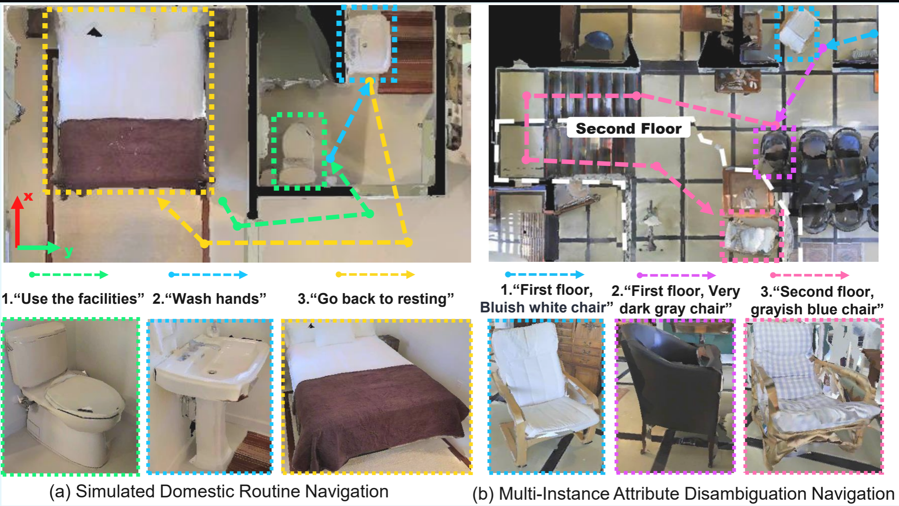

# FG-ObjectNav-dataset
To comprehensively evaluate the perception of fine-grained attributes and the ability to sustain long-horizon tasks, we introduce the FG-Nav dataset, a fine-grained, description-oriented, multi-floor long-horizon navigation benchmark.

The benchmark construction involves a rigorous scene selection and task generation process. We filtered MP3D to retain 9 distinct scenes stratified by scale and object density, ranging from expansive, object-rich environments to small, sparse settings. To ensure comprehensive assessment, task allocation is calibrated to scene complexity: object-dense scenes are assigned more than ten navigation sequences (approx. 100 target objects) to stress-test attribute disambiguation, while sparse scenes contain fewer sequences for robustness evaluation. This stratified protocol rigorously examines the robustness of attribute modeling across varying environmental complexities.